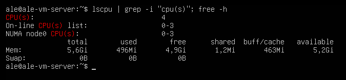

# KN01

## Konsole ausgabe bei weniger CPU und RAM als das Host-System hat

## Konsole ausgabe bei mehr CPU und RAM als das Host-System hat

## Erklärung wie es möglich ist, dass man mehr Ressourcen zuteilen kann als Ihr Host-System hat.

### meine Überlegung:

Meine Vermutung ist, dass ein virtueller Speicher der zugewiesenen Ressourcen erstellt wird (z.b CPU -> vCPUs) und dann
nur das verwendet, was er wirklich benötigt. Bei Bedarf nimmt er die Ressourcen, die ihm zur Verfügung
stehen, oder lagert bestimmte Teile aus (z.B von einer anderen Vm), um sie zu verwenden.
Es könnte auch möglich sein, dass beim RAM eine Swap-Partition erstellt wird. 

### Wieso ist es wirklich:

Das Betriebssystem erstellt eine Swap-Datei. Das bedeutet, dass ich mehr 'RAM' nutzen kann, allerdings ist dieser langsamer,
da die Swap-Datei auf der Festplatte liegt.

Bei der CPU werden mehr Threads verwendet (Typ 2 Hypervisor) und die CPU-Ressourcen werden zwischen dem gesamten 
Betriebssystem und den virtuellen Maschinen aufgeteilt
