# KN02

# Lab 4.1 - EC2

## Webseite mit Public IP
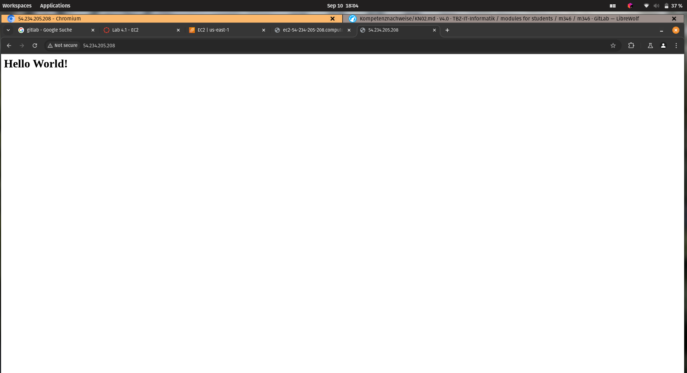

## Webseite mit DNS
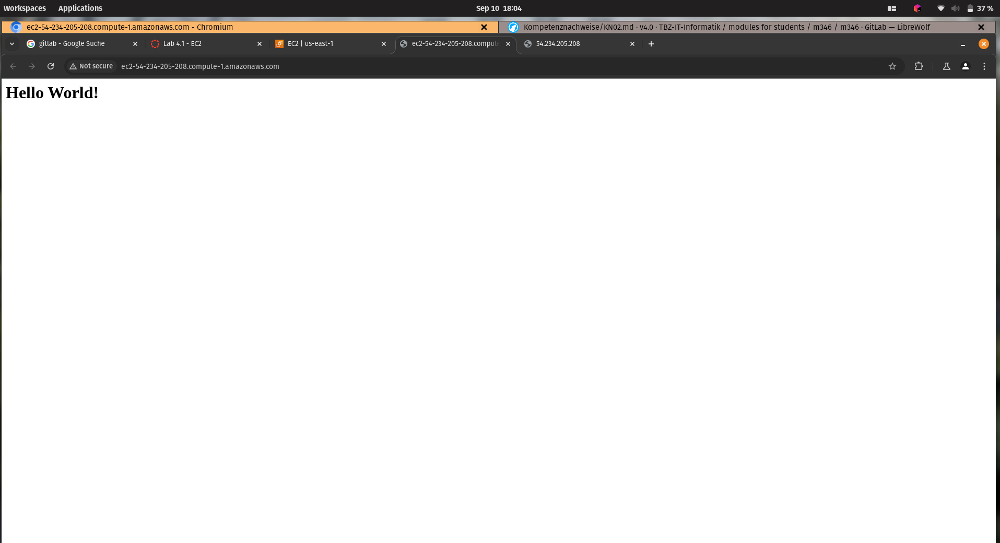

## Liste der EC2-Instanzen
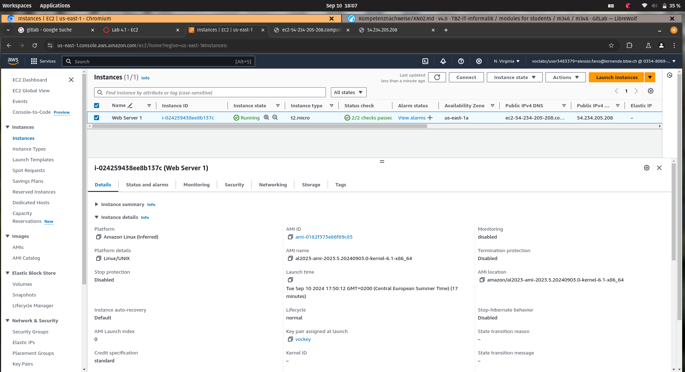

## Details der Web Server-Instanz 
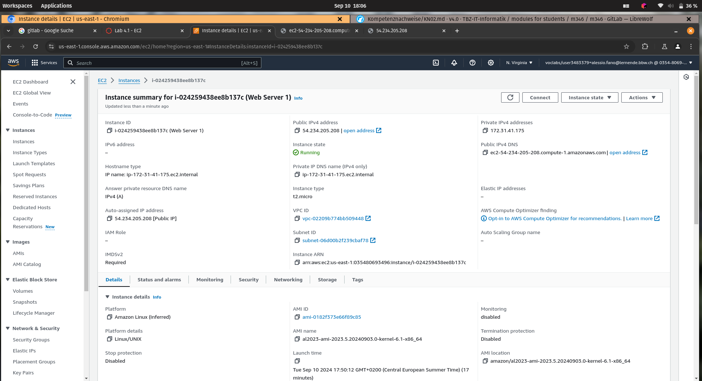

## Liste der Inbound-Regeln
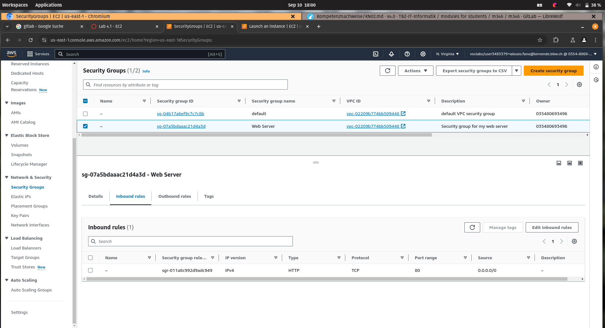

# Lab 4.2 - S3

## Liste der Buckets
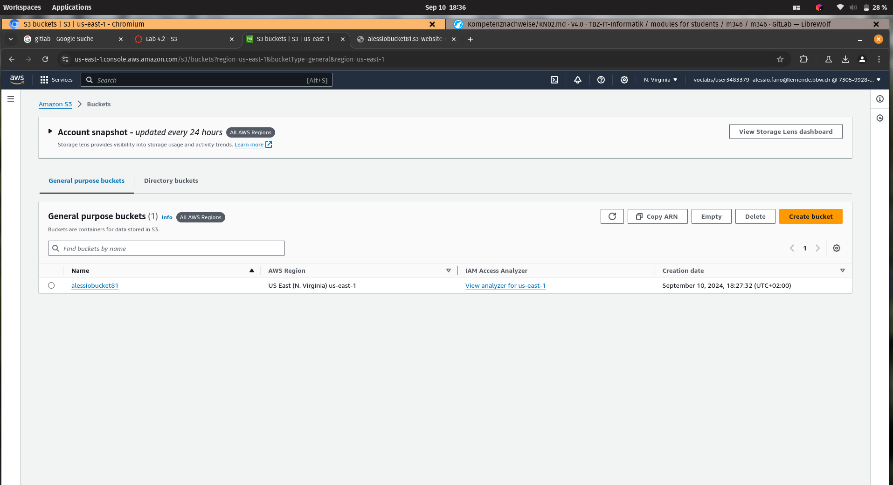

## Browsers mit der geöffneten öffentlichen HTML-Seite
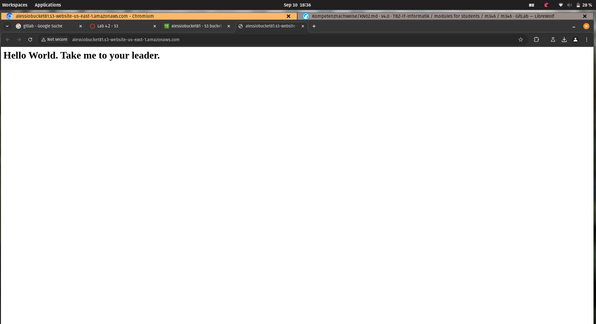

## Liste der Dateien im Bucket
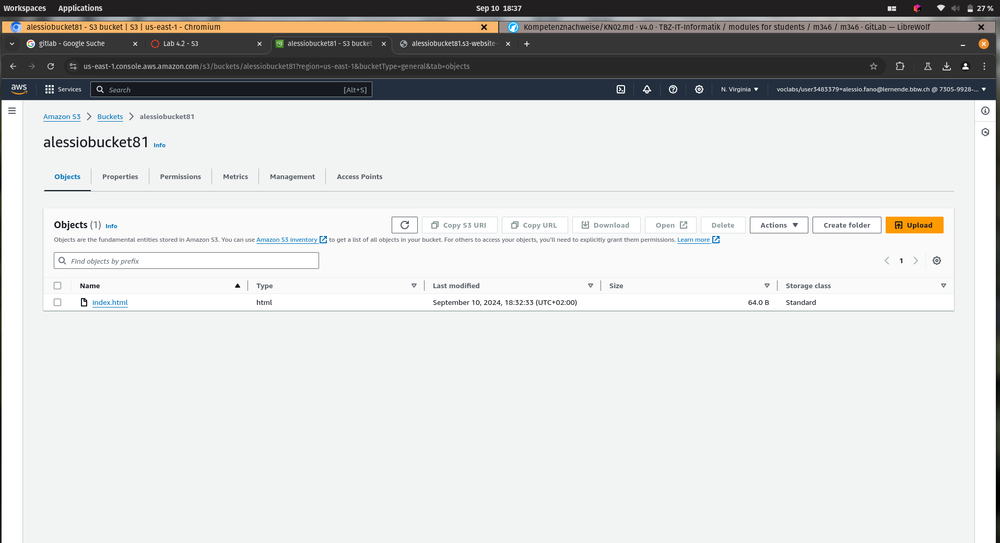

## Eigenschaften von "Static website hosting"
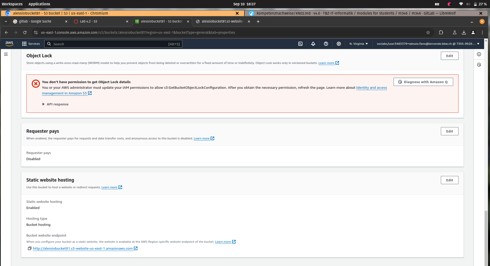

## Bucket-Policy für den öffentlichen Zugriff

```json
{
    "Version": "2012-10-17",
    "Statement": [
        {
            "Sid": "PublicReadGetObject",
            "Effect": "Allow",
            "Principal": "*",
            "Action": "s3:GetObject",
            "Resource": "arn:aws:s3:::alessiobucket81/*"
        }
    ]
}
```

# Zugriff mit SSH-Key

##  Verwendung des ersten Schlüssels
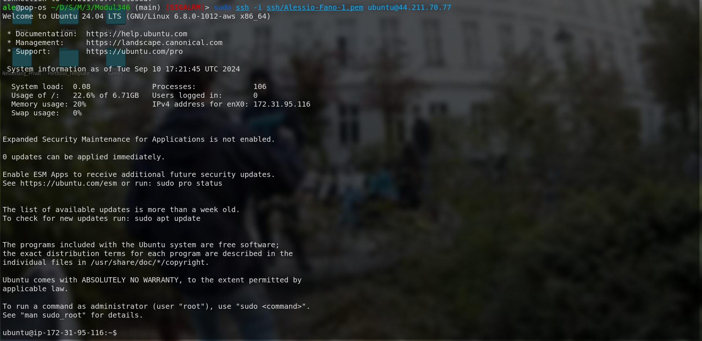

##  Verwendung des zweiten Schlüssels
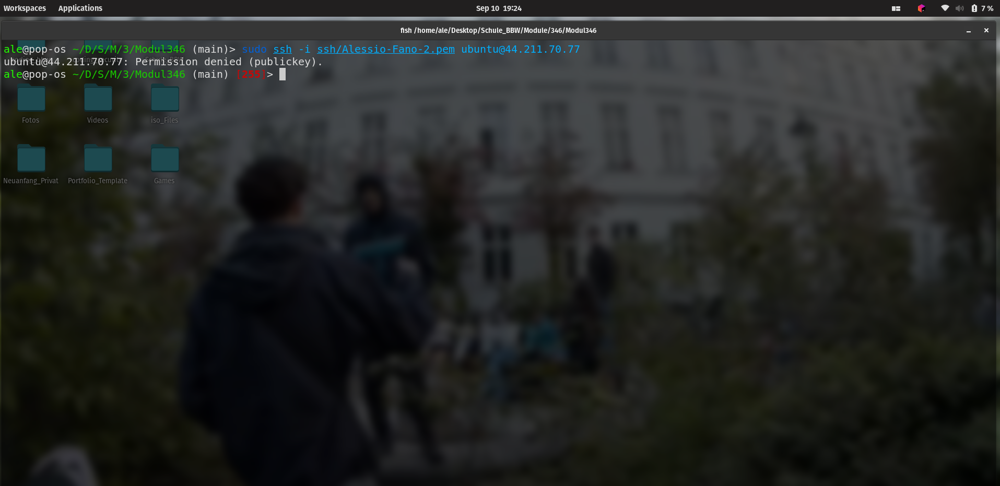

##  Instanz-Detail der verwendeter Schlüssel
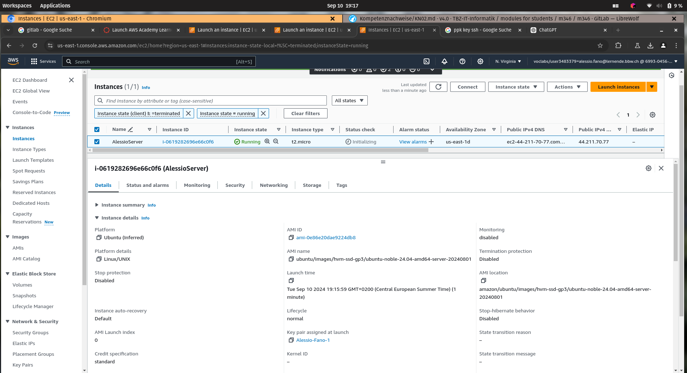