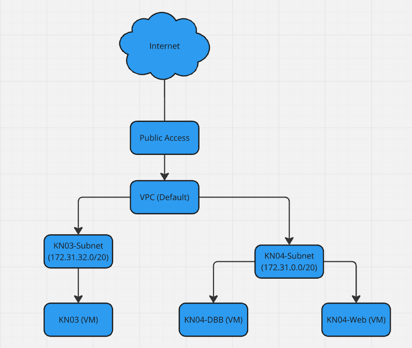

# KN04

## Diagramm erstellen und erklärungen

### Was ist ein VPC?

Eine Virtual Private Cloud (VPC) ist ein isoliertes
Netzwerk innerhalb der Cloud Umgebung, dass ermöglicht eigenen
virtuellen Netzwerke mit sicherem Zugriff, 
spezifischen Subnetzen und individuellen Sicherheitsregeln zu erstellen 
und zu verwalten.

### Was ist ein Subnetz?

Ein Subnetz ist ein kleinerer, abgegrenzter/Separierter Teil eines Netzwerks,
der dazu dient, den IP-Adressraum zu spezifizieren und den Datenverkehr
innerhalb eines Netzwerks effizienter/schneller zu steuern.

## Subnetz und private IP wählen

### Screenshot der Subnetzen, die die Namen zeigen

### Zwei definierte IPs für Web- und DB-Server/Instanz

Web-Server: 172.31.0.10

DB-Server: 172.31.0.20

## Sicherheitsgruppe

### Screenshot der Liste der Sicherheitsgruppe mit sprechenden Namen/Feldern und Screenshot der Inbound-Regeln für Web Sicherheitsgruppen

### Screenshot der Liste der Sicherheitsgruppe mit sprechenden Namen/Feldern und Screenshot der Inbound-Regeln für DB Sicherheitsgruppen

## Öffentliche, statische IPs

## Instanz erstellen

### Screenshot der Liste der Instanzen, wenn beide Instanzen gestoppt sind. Das Feld der öffentlichen IP und der Status (gestoppt) müssen sichtbar sein.

### DB

### Web

### Screenshot der Details beider Instanzen, so dass die Subnet ID sichtbar ist.

### DB

### Web

## Datei Anpassung

### Seiten aufrufen

### index.html

### info.php

### db.php

