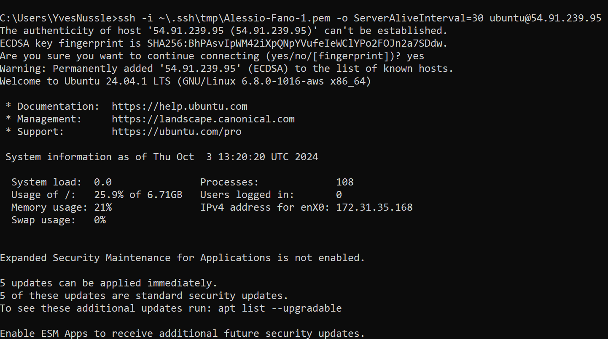

# KN05

## Cloud-init Datei Verstehen

```` yaml
#cloud-config
users: # Definiert eine Liste von Benutzern, die erstellt werden sollen
  - name: ubuntu # Benutzername
    sudo: ALL=(ALL) NOPASSWD:ALL # Darf alle Befehle als Root-Benutzer ohne Passwort ausführen
    groups: users, admin # Fügt den Benutzer zu diesen Gruppen hinzu
    home: /home/ubuntu # Legt dieses Verzeichnis als Benutzer-Home fest
    shell: /bin/bash # Setzt die Standard-Shell für den Benutzer
    ssh_authorized_keys: # Liste von SSH Schlüsseln für die Benutzer Authentifizierung
      - ssh-rsa AAAAB3NzaC1yc2EAAAADAQABAAABAQC0WGP1EZykEtv5YGC9nMiPFW3U3DmZNzKFO5nEu6uozEHh4jLZzPNHSrfFTuQ2GnRDSt+XbOtTLdcj26+iPNiFoFha42aCIzYjt6V8Z+SQ9pzF4jPPzxwXfDdkEWylgoNnZ+4MG1lNFqa8aO7F62tX0Yj5khjC0Bs7Mb2cHLx1XZaxJV6qSaulDuBbLYe8QUZXkMc7wmob3PM0kflfolR3LE7LResIHWa4j4FL6r5cQmFlDU2BDPpKMFMGUfRSFiUtaWBNXFOWHQBC2+uKmuMPYP4vJC9sBgqMvPN/X2KyemqdMvdKXnCfrzadHuSSJYEzD64Cve5Zl9yVvY4AqyBD aws-key # Der SSH-Schlüssel, der erlaubt wird
ssh_pwauth: false # Deaktiviert die SSH Passwort Authentifizierung
disable_root: false # Deaktiviert den Root-Benutzer nicht auf dem Server
package_update: true # Aktualisiert die Pakete auf die neueste Version
packages: # Liste von packages via packagemanager, die auf dem Server installiert werden sollen
  - curl # package 1
  - wget # package 2
````

## SSH-Key und Cloud-init

## Meine Cloud-init Konfiguration
````yaml
#cloud-config
users:
  - name: ubuntu
    sudo: ALL=(ALL) NOPASSWD:ALL
    groups: users, admin
    home: /home/ubuntu
    shell: /bin/bash
    ssh_authorized_keys:
      - ssh-rsa AAAAB3NzaC1yc2EAAAADAQABAAABAQC9b0rWS3fT91npC+LABLOBlQ7gCUoOB4CVwhEwqoHtfRz3elTwgqQ/LhwrwAODGmK+5KJNd+QVDst0yNtj5nGNLtFLIsxOx0W/8xSIBhkpebPgdqiqmExRiK5QQV8DdQp95LqdKzAjTKdCLk0CLaoaEPS4VkGjcdqvQk+k8BXkVx1tDvPbGHdh6yKDyi7v6Mm8zszs69sfBA+BR//bGHjo+/kefkfzPGP6Y3A+ccu2mhJaOXq0xZYrA7+mtXIHn1TiFxIO4DF788DlhwDd73ukQqe2BDIL9IszuLJ9EGctuNIiMWPCsstUxdK8LZ8hPUOYdc5Z67OGtrCJ4uXWeC6n
ssh_pwauth: false
disable_root: false 
package_update: true
packages:
  - curl 
  - wget 

````

## Ein Screenshot der Details der Instanz. ("Key pair assigned at launch")


## Screenshot mit dem ssh-Befehl und des Resultats unter Verwendung des ersten Schlüssels.



## Screenshot mit dem ssh-Befehl und des Resultats unter Verwendung des zweiten Schlüssels.


## Screenshot mit dem Auszug aus dem Cloud-Init-Log. 


## Erstellen Sie sich ein Cloud-Init Template mit pub Lehrer

```
#cloud-config
users:
  - name: ubuntu
    groups: [users, admin]
    shell: /bin/bash
    ssh_authorized_keys:
      - ssh-rsa AAAAB3NzaC1yc2EAAAADAQABAAABAQC9b0rWS3fT91npC+LABLOBlQ7gCUoOB4CVwhEwqoHtfRz3elTwgqQ/LhwrwAODGmK+5KJNd+QVDst0yNtj5nGNLtFLIsxOx0W/8xSIBhkpebPgdqiqmExRiK5QQV8DdQp95LqdKzAjTKdCLk0CLaoaEPS4VkGjcdqvQk+k8BXkVx1tDvPbGHdh6yKDyi7v6Mm8zszs69sfBA+BR//bGHjo+/kefkfzPGP6Y3A+ccu2mhJaOXq0xZYrA7+mtXIHn1TiFxIO4DF788DlhwDd73ukQqe2BDIL9IszuLJ9EGctuNIiMWPCsstUxdK8LZ8hPUOYdc5Z67OGtrCJ4uXWeC6n
      - ssh-rsa AAAAB3NzaC1yc2EAAAADAQABAAABAQC0WGP1EZykEtv5YGC9nMiPFW3U3DmZNzKFO5nEu6uozEHh4jLZzPNHSrfFTuQ2GnRDSt+XbOtTLdcj26+iPNiFoFha42aCIzYjt6V8Z+SQ9pzF4jPPzxwXfDdkEWylgoNnZ+4MG1lNFqa8aO7F62tX0Yj5khjC0Bs7Mb2cHLx1XZaxJV6qSaulDuBbLYe8QUZXkMc7wmob3PM0kflfolR3LE7LResIHWa4j4FL6r5cQmFlDU2BDPpKMFMGUfRSFiUtaWBNXFOWHQBC2+uKmuMPYP4vJC9sBgqMvPN/X2KyemqdMvdKXnCfrzadHuSSJYEzD64Cve5Zl9yVvY4AqyBD
      - ssh-rsa AAAAB3NzaC1yc2EAAAADAQABAAACAQCz/wpWmsCxaQyuNFrIachc/q9nUdByoUcBcicl/wnKLFktKp6du9np9Uhmo4M0tVHNnWCt5uNEi2ks/0XEbg2J+4heuAAKEDr/TVbgabiWGclYKpEWZvmw8gsQwfpAKVG4aS2re7wB2uhw82ZqzJVpGm3ne+sNnz5uVrxN8HUnuR2OWJD6bA9l/fBmE6zdObVXgrCJGjZmVyB5GMeTDJKExgoBpLggZn9CNdu7Sx989xtNLehu6SWM+mGCq9Lcu7usiPG+SuEb8XynYaCOnv8+Oko6SYeJ9Omq/E7Eg6vZHqCbBQ81TIZrGKcikLmF2xP7EOprGOSPVewke7ak7vvmOI+p/RfIAyXj1+GYny+esk9G+qDRFXP9uiIlMfH1oGkQkztvSDMH+EOHqgY66NWQJPj83CaWH/euR0MROHXjm1ar3RuN9qcASAnzCOQQ1FMwFkpIV5x0NDRx0Zp1rLt8ZUFykmIuHZI4g9u6RdAiuWUxx9/eF0fXZa6Ju7GEMKeMtZxJJjmB/WCOylbkT+NPw5RcxgyRLKmUAicnYKXBmULY3pQM/Ui8KiCyJqRbLDBAR+XZYsZ7X5uhcuteu8KIfA2xEbInB4Q3c0DnnSih+GEC4pEbz+NOfeCpLJEn4gfyV1S9S08sG62ls8NPFociA9aWmE1oXfcqwvOkkYhxOw==
    sudo: ALL=(ALL) NOPASSWD:ALL
ssh_pwauth: false
disable_root: false
package_update: true
packages:
  - curl
  - wget
```

## Automatisierung DB Server

```
#cloud-config
users:
  - name: ubuntu
    groups: [users, admin]
    shell: /bin/bash
    ssh_authorized_keys:
      - ssh-rsa AAAAB3NzaC1yc2EAAAADAQABAAABAQC9b0rWS3fT91npC+LABLOBlQ7gCUoOB4CVwhEwqoHtfRz3elTwgqQ/LhwrwAODGmK+5KJNd+QVDst0yNtj5nGNLtFLIsxOx0W/8xSIBhkpebPgdqiqmExRiK5QQV8DdQp95LqdKzAjTKdCLk0CLaoaEPS4VkGjcdqvQk+k8BXkVx1tDvPbGHdh6yKDyi7v6Mm8zszs69sfBA+BR//bGHjo+/kefkfzPGP6Y3A+ccu2mhJaOXq0xZYrA7+mtXIHn1TiFxIO4DF788DlhwDd73ukQqe2BDIL9IszuLJ9EGctuNIiMWPCsstUxdK8LZ8hPUOYdc5Z67OGtrCJ4uXWeC6n
      - ssh-rsa AAAAB3NzaC1yc2EAAAADAQABAAABAQC0WGP1EZykEtv5YGC9nMiPFW3U3DmZNzKFO5nEu6uozEHh4jLZzPNHSrfFTuQ2GnRDSt+XbOtTLdcj26+iPNiFoFha42aCIzYjt6V8Z+SQ9pzF4jPPzxwXfDdkEWylgoNnZ+4MG1lNFqa8aO7F62tX0Yj5khjC0Bs7Mb2cHLx1XZaxJV6qSaulDuBbLYe8QUZXkMc7wmob3PM0kflfolR3LE7LResIHWa4j4FL6r5cQmFlDU2BDPpKMFMGUfRSFiUtaWBNXFOWHQBC2+uKmuMPYP4vJC9sBgqMvPN/X2KyemqdMvdKXnCfrzadHuSSJYEzD64Cve5Zl9yVvY4AqyBD
      - ssh-rsa AAAAB3NzaC1yc2EAAAADAQABAAACAQCz/wpWmsCxaQyuNFrIachc/q9nUdByoUcBcicl/wnKLFktKp6du9np9Uhmo4M0tVHNnWCt5uNEi2ks/0XEbg2J+4heuAAKEDr/TVbgabiWGclYKpEWZvmw8gsQwfpAKVG4aS2re7wB2uhw82ZqzJVpGm3ne+sNnz5uVrxN8HUnuR2OWJD6bA9l/fBmE6zdObVXgrCJGjZmVyB5GMeTDJKExgoBpLggZn9CNdu7Sx989xtNLehu6SWM+mGCq9Lcu7usiPG+SuEb8XynYaCOnv8+Oko6SYeJ9Omq/E7Eg6vZHqCbBQ81TIZrGKcikLmF2xP7EOprGOSPVewke7ak7vvmOI+p/RfIAyXj1+GYny+esk9G+qDRFXP9uiIlMfH1oGkQkztvSDMH+EOHqgY66NWQJPj83CaWH/euR0MROHXjm1ar3RuN9qcASAnzCOQQ1FMwFkpIV5x0NDRx0Zp1rLt8ZUFykmIuHZI4g9u6RdAiuWUxx9/eF0fXZa6Ju7GEMKeMtZxJJjmB/WCOylbkT+NPw5RcxgyRLKmUAicnYKXBmULY3pQM/Ui8KiCyJqRbLDBAR+XZYsZ7X5uhcuteu8KIfA2xEbInB4Q3c0DnnSih+GEC4pEbz+NOfeCpLJEn4gfyV1S9S08sG62ls8NPFociA9aWmE1oXfcqwvOkkYhxOw==
    sudo: ALL=(ALL) NOPASSWD:ALL
ssh_pwauth: false
disable_root: false
package_update: true
packages:
  - curl
  - wget
  - mariadb-server
runcmd:
  - sudo mysql -sfu root -e "GRANT ALL ON *.* TO 'admin'@'%' IDENTIFIED BY 'password' WITH GRANT OPTION;"
  - sudo sed -i 's/127.0.0.1/0.0.0.0/g' /etc/mysql/mariadb.conf.d/50-server.cnf
  - sudo systemctl restart mariadb.service
```

## Automatisierung Web Server

```
#cloud-config
users:
  - name: ubuntu
    groups: [users, admin]
    shell: /bin/bash
    ssh_authorized_keys:
      - ssh-rsa AAAAB3NzaC1yc2EAAAADAQABAAABAQC9b0rWS3fT91npC+LABLOBlQ7gCUoOB4CVwhEwqoHtfRz3elTwgqQ/LhwrwAODGmK+5KJNd+QVDst0yNtj5nGNLtFLIsxOx0W/8xSIBhkpebPgdqiqmExRiK5QQV8DdQp95LqdKzAjTKdCLk0CLaoaEPS4VkGjcdqvQk+k8BXkVx1tDvPbGHdh6yKDyi7v6Mm8zszs69sfBA+BR//bGHjo+/kefkfzPGP6Y3A+ccu2mhJaOXq0xZYrA7+mtXIHn1TiFxIO4DF788DlhwDd73ukQqe2BDIL9IszuLJ9EGctuNIiMWPCsstUxdK8LZ8hPUOYdc5Z67OGtrCJ4uXWeC6n
      - ssh-rsa AAAAB3NzaC1yc2EAAAADAQABAAABAQC0WGP1EZykEtv5YGC9nMiPFW3U3DmZNzKFO5nEu6uozEHh4jLZzPNHSrfFTuQ2GnRDSt+XbOtTLdcj26+iPNiFoFha42aCIzYjt6V8Z+SQ9pzF4jPPzxwXfDdkEWylgoNnZ+4MG1lNFqa8aO7F62tX0Yj5khjC0Bs7Mb2cHLx1XZaxJV6qSaulDuBbLYe8QUZXkMc7wmob3PM0kflfolR3LE7LResIHWa4j4FL6r5cQmFlDU2BDPpKMFMGUfRSFiUtaWBNXFOWHQBC2+uKmuMPYP4vJC9sBgqMvPN/X2KyemqdMvdKXnCfrzadHuSSJYEzD64Cve5Zl9yVvY4AqyBD
      - ssh-rsa AAAAB3NzaC1yc2EAAAADAQABAAACAQCz/wpWmsCxaQyuNFrIachc/q9nUdByoUcBcicl/wnKLFktKp6du9np9Uhmo4M0tVHNnWCt5uNEi2ks/0XEbg2J+4heuAAKEDr/TVbgabiWGclYKpEWZvmw8gsQwfpAKVG4aS2re7wB2uhw82ZqzJVpGm3ne+sNnz5uVrxN8HUnuR2OWJD6bA9l/fBmE6zdObVXgrCJGjZmVyB5GMeTDJKExgoBpLggZn9CNdu7Sx989xtNLehu6SWM+mGCq9Lcu7usiPG+SuEb8XynYaCOnv8+Oko6SYeJ9Omq/E7Eg6vZHqCbBQ81TIZrGKcikLmF2xP7EOprGOSPVewke7ak7vvmOI+p/RfIAyXj1+GYny+esk9G+qDRFXP9uiIlMfH1oGkQkztvSDMH+EOHqgY66NWQJPj83CaWH/euR0MROHXjm1ar3RuN9qcASAnzCOQQ1FMwFkpIV5x0NDRx0Zp1rLt8ZUFykmIuHZI4g9u6RdAiuWUxx9/eF0fXZa6Ju7GEMKeMtZxJJjmB/WCOylbkT+NPw5RcxgyRLKmUAicnYKXBmULY3pQM/Ui8KiCyJqRbLDBAR+XZYsZ7X5uhcuteu8KIfA2xEbInB4Q3c0DnnSih+GEC4pEbz+NOfeCpLJEn4gfyV1S9S08sG62ls8NPFociA9aWmE1oXfcqwvOkkYhxOw==
    sudo: ALL=(ALL) NOPASSWD:ALL
ssh_pwauth: false
disable_root: false
package_update: true
packages:
  - curl
  - wget
  - apache2
  - php
  - libapache2-mod-php
  - php-mysqli
  - adminer
write_files:
  - path: /var/www/html/info.php
    content: |
      <?php
      phpinfo();
      ?>
    permissions: "0644"
    owner: www-data:www-data
  - path: /var/www/html/db.php
    content: |
      <?php
      //database
      $servername = "172.31.0.21";
      $username = "admin";
      $password = "password";
      $dbname = "mysql";

      // Create connection
      $conn = new mysqli($servername, $username, $password, $dbname);
      // Check connection
      if ($conn->connect_error) {
              die("Connection failed: " . $conn->connect_error);
      }

      $sql = "select Host, User from mysql.user;";
      $result = $conn->query($sql);
      while($row = $result->fetch_assoc()){
              echo($row["Host"] . " / " . $row["User"] . "<br />");
      }
      //var_dump($result);
      ?>
    permissions: "0644"
    owner: www-data:www-data
runcmd:
  - sudo a2enconf adminer
  - sudo systemctl restart apache2
```

## Auf Rufen den Seiten index.html, info.php, adminer und db.php


