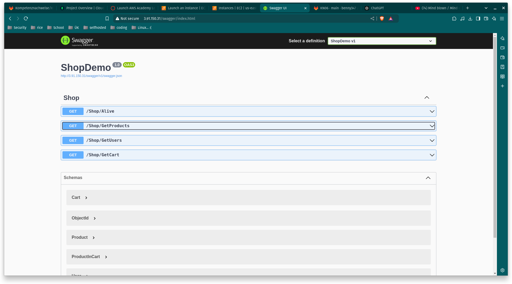

# KN06

## Installation App

### Was ist eine Reverse Proxy

Ein Reverse Proxy bietet den Vorteil, eine IPv4-Adresse für mehrere DNS-Domains zu nutzen. 
Zudem kann man für eine DNS-Domain unterschiedliche Routen für verschiedene Services festlegen. 
Beispielsweise könnten unter example.com/a der Service A und unter example.com/b der Service B laufen.

### Swagger-URL aufrufen



### Den Endpoint GetProducts aufrufen können (via Swagger)


###  MongoDB Collections mit Auszug aus dem Inhalt


## Vertikale Skalierung 

### Vorher-Nachher Screenshots der Instanz-Ressourcen

##### Festplatten erweiterung

##### Vorher


##### Nachher


##### Erklärung 

Ich konnte die Festplatte bei **laufendem Betrieb** erweitern, ich musste sie nur
die Festplatte anwählen, bearbeiten drücken und meine gewünschte Speicher Kapazität anwählen.

#### Änderung Instanztyp

##### Vorher


##### Nachher


##### Erklärung

Ich musste die Instanz **erst runterfahren** bevor ich die einstellung vornehmen konnte,
So konnte ich von mehreren Typen wählen und wählte den Typ der verlangt wurde aus.

## Horizontale Skalierung 


### DNS

Wir würden einen CNAME-Eintrag zur Domain app.tbz-m346.ch hinzufügen, wobei der Wert die Domain des Load Balancers ist.

### Übersicht

Loadbalancer info 


Target group


Instanz


## Auto Scaling

Wird getestet von Herr Nusle in der AWS-Cloud Umgebung.

## Evaluation Cloud-Init 

Die Cloud-Init-Datei enthält verschiedene Verbesserungen, darunter:

Theoretisch könnte ein Fehler auftreten, wenn sich die Shell nicht an diesem Speicherort befindet:
```shell: /bin/bash```

Auf einem Produktionsserver sollten wir die SSH-Passwort-Authentifizierung immer deaktivieren, da die Authentifizierung mit öffentlichen Schlüsseln sicherer ist:
```ssh_pwauth: true```

Wir sollten auch den Zugriff auf den Root-Benutzer deaktivieren, da es dann schwieriger ist, die ausgeführten Befehle nachzuvollziehen, wenn sie als Root ausgeführt wurden:
```disable_root: false```

Ausserdem haben wir die MongoDB-Zugangsdaten im Cloud-Init fest codiert, was man im grundsatz nicht tuen soll.

Alle Befehle werden über ```sudo``` ausgeführt, obwohl der Benutzer ```root``` ist.

Wir laden Daten von mehreren Websites herunter, darunter Gitlab und MongoDB. Theoretisch könnten diese Websites offline gehen, was zu einem Ausfall des Auto Scalers führen würde.