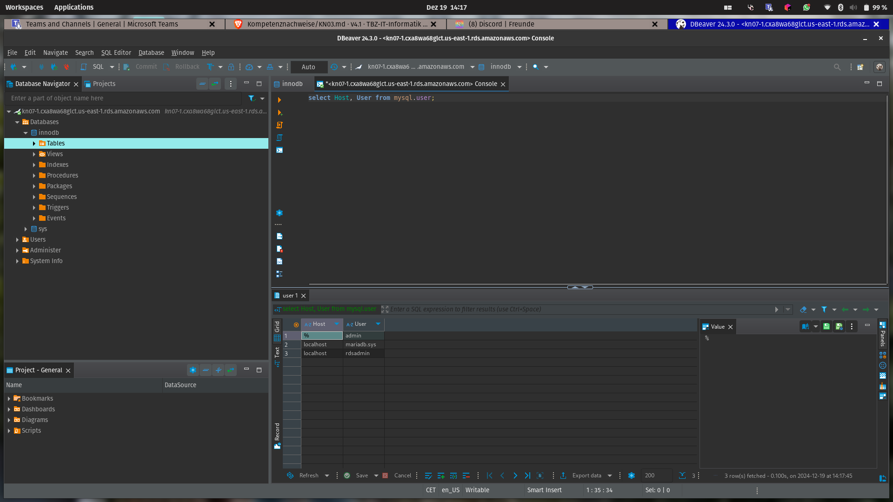
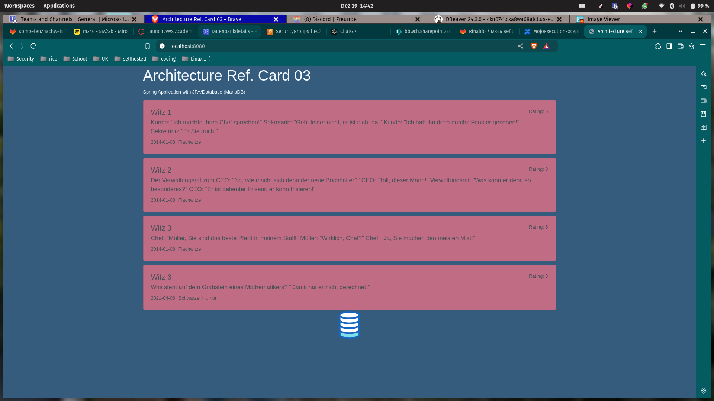
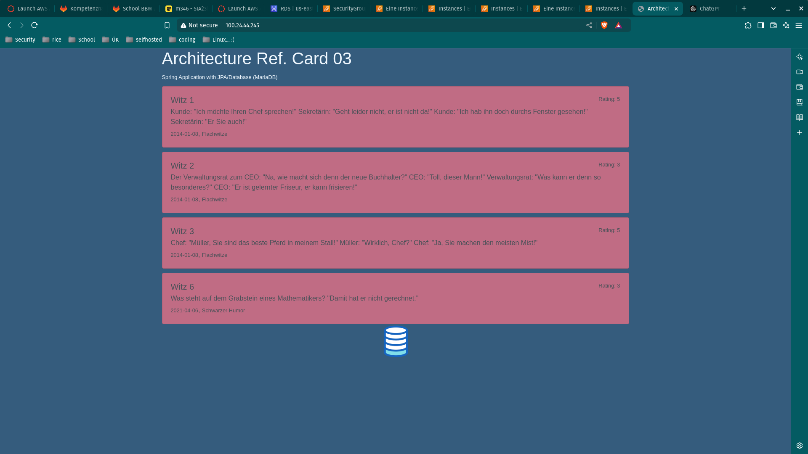

# KN07

## Screenshot aus MySqlWorkbench/ DBeaver mit dem ausgeführtem Query 



## Erklären Sie wieso Sie besser einen PAAS oder SAAS Service verwenden anstatt eine eigene Datenbank zu installieren 

PaaS oder SaaS sind oft besser, weil sie kostengünstiger, einfacher zu verwalten und schneller einsatzbereit sind. Der Anbieter kümmert 
sich um Wartung, Updates, Sicherheit und Skalierung. Eine eigene Datenbank ist teurer, aufwändiger und erfordert mehr technisches Know-how.

## Screenshot der funktionierende Seiten mit Daten aus der Datenbank sichtbar.



## Screenshot der funktionierenden Seiten mit Daten aus der Datenbank sichtbar.



```yaml
#cloud-config
users:
  - name: ubuntu
    sudo: ALL=(ALL) NOPASSWD:ALL
    groups: users, admin
    home: /home/ubuntu
    shell: /bin/bash
    ssh_authorized_keys:
      - ssh-rsa AAAAB3NzaC1yc2EAAAADAQABAAABAQC9b0rWS3fT91npC+LABLOBlQ7gCUoOB4CVwhEwqoHtfRz3elTwgqQ/LhwrwAODGmK+5KJNd+QVDst0yNtj5nGNLtFLIsxOx0W/8xSIBhkpebPgdqiqmExRiK5QQV8DdQp95LqdKzAjTKdCLk0CLaoaEPS4VkGjcdqvQk+k8BXkVx1tDvPbGHdh6yKDyi7v6Mm8zszs69sfBA+BR//bGHjo+/kefkfzPGP6Y3A+ccu2mhJaOXq0xZYrA7+mtXIHn1TiFxIO4DF788DlhwDd73ukQqe2BDIL9IszuLJ9EGctuNIiMWPCsstUxdK8LZ8hPUOYdc5Z67OGtrCJ4uXWeC6n
      - ssh-rsa AAAAB3NzaC1yc2EAAAADAQABAAABAQC0WGP1EZykEtv5YGC9nMiPFW3U3DmZNzKFO5nEu6uozEHh4jLZzPNHSrfFTuQ2GnRDSt+XbOtTLdcj26+iPNiFoFha42aCIzYjt6V8Z+SQ9pzF4jPPzxwXfDdkEWylgoNnZ+4MG1lNFqa8aO7F62tX0Yj5khjC0Bs7Mb2cHLx1XZaxJV6qSaulDuBbLYe8QUZXkMc7wmob3PM0kflfolR3LE7LResIHWa4j4FL6r5cQmFlDU2BDPpKMFMGUfRSFiUtaWBNXFOWHQBC2+uKmuMPYP4vJC9sBgqMvPN/X2KyemqdMvdKXnCfrzadHuSSJYEzD64Cve5Zl9yVvY4AqyBD
      - ssh-rsa AAAAB3NzaC1yc2EAAAADAQABAAACAQCz/wpWmsCxaQyuNFrIachc/q9nUdByoUcBcicl/wnKLFktKp6du9np9Uhmo4M0tVHNnWCt5uNEi2ks/0XEbg2J+4heuAAKEDr/TVbgabiWGclYKpEWZvmw8gsQwfpAKVG4aS2re7wB2uhw82ZqzJVpGm3ne+sNnz5uVrxN8HUnuR2OWJD6bA9l/fBmE6zdObVXgrCJGjZmVyB5GMeTDJKExgoBpLggZn9CNdu7Sx989xtNLehu6SWM+mGCq9Lcu7usiPG+SuEb8XynYaCOnv8+Oko6SYeJ9Omq/E7Eg6vZHqCbBQ81TIZrGKcikLmF2xP7EOprGOSPVewke7ak7vvmOI+p/RfIAyXj1+GYny+esk9G+qDRFXP9uiIlMfH1oGkQkztvSDMH+EOHqgY66NWQJPj83CaWH/euR0MROHXjm1ar3RuN9qcASAnzCOQQ1FMwFkpIV5x0NDRx0Zp1rLt8ZUFykmIuHZI4g9u6RdAiuWUxx9/eF0fXZa6Ju7GEMKeMtZxJJjmB/WCOylbkT+NPw5RcxgyRLKmUAicnYKXBmULY3pQM/Ui8KiCyJqRbLDBAR+XZYsZ7X5uhcuteu8KIfA2xEbInB4Q3c0DnnSih+GEC4pEbz+NOfeCpLJEn4gfyV1S9S08sG62ls8NPFociA9aWmE1oXfcqwvOkkYhxOw==
ssh_pwauth: true
disable_root: false  
package_update: true 
packages:
  - curl
  - wget
  - nginx
  - openjdk-17-jdk
  - maven
write_files:
  - content: |
      [Unit]
      Description=Demo Shop
      After=syslog.target
      [Service]
      WorkingDirectory=/var/www/app
      User=www-data
      ExecStart=java -DDB_USERNAME="admin" -DDB_PASSWORD="9NUd8sclXrP2fZfNWf0w" -DDB_URL="jdbc:mariadb://database-07.cwumqodeaoig.us-east-1.rds.amazonaws.com:3306/refcard" -jar /var/www/app/m346scripts/target/architecture-refcard-03-0.0.1-SNAPSHOT.jar 
      Restart=always
      RestartSec=10
      [Install] 
      WantedBy=multi-user.target
    path: /etc/systemd/system/DB-app.service
  - content: |
      server {
        listen        80;
        server_name   default;
        location / {
          proxy_pass         http://127.0.0.1:8080;
          proxy_http_version 1.1;
          proxy_set_header   Upgrade $http_upgrade;
          proxy_set_header   Connection keep-alive;
          proxy_set_header   Host $host;
          proxy_cache_bypass $http_upgrade;
          proxy_set_header   X-Forwarded-For $proxy_add_x_forwarded_for;
          proxy_set_header   X-Forwarded-Proto $scheme;
        }
      }
    path: /home/ubuntu/nginx
runcmd:
  - sudo mkdir /var/www
  - sudo mkdir /var/www/app
  - sudo git clone https://gitlab.com/bbwrl/m346-ref-card-03.git /home/ubuntu/m346scripts
  - sudo cp -r /home/ubuntu/m346scripts /var/www/app
  - cd /var/www/app/m346scripts
  - sudo chown -R ubuntu:ubuntu /home/ubuntu
  - sudo chown -R ubuntu:ubuntu /var/www/app/m346scripts
  - mvn package
  - sudo systemctl enable DB-app.service
  - sudo systemctl start DB-app.service
  - sudo service nginx start
  - sudo cp /home/ubuntu/nginx /etc/nginx/sites-available/default
  - sudo nginx -s reload
```

