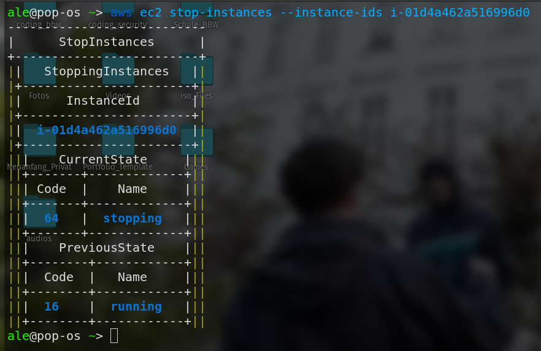
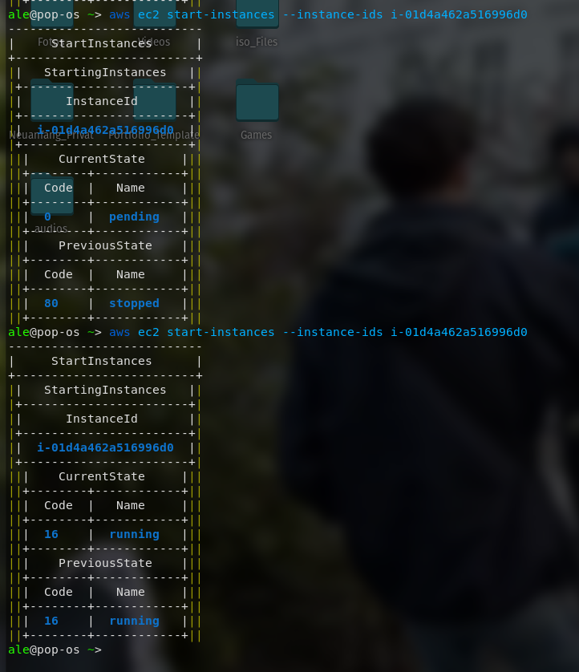
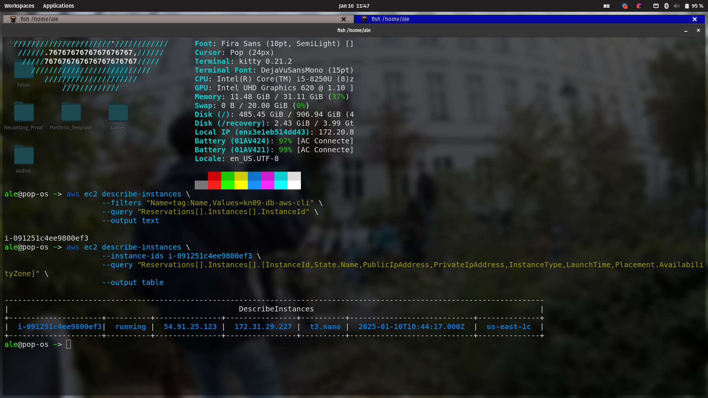
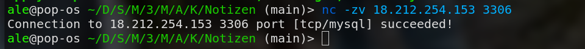

# KN09

## Automatisierung mit Command Line Interface (CLI)

### Screenshot der Details der Instanz, die Sie stoppen und starten

#### Stop



```
# Stoppen einer Instanz
aws ec2 stop-instances --instance-ids <INSTANCE_ID>
```

#### Starten 



```
# Starten der Instanz
aws ec2 start-instances --instance-ids <INSTANCE_ID>
```

#### erstellen der neuen DB instanz per cli 

```
aws ec2 run-instances \
    --image-id ami-0a0e5d9c7acc336f1 \
    --count 1 \
    --instance-type t3.nano \
    --key-name vockey \
    --security-group-ids sg-00eac325e9ff2ff58 \
    --subnet-id subnet-0798a380c932c0e24 \
    --user-data file:///home/ale/Desktop/Schule_BBW/Module/346/Modul346/Abgabe/KN05/Notizen/cloud-init-db.yml \
    --tag-specifications 'ResourceType=instance,Tags=[{Key=Name,Value=kn09-db-aws-cli}]' \
    --no-paginate \
```

```
#output nach erstellen der Instanz 

|                           RunInstances                            |
+---------------------------+---------------------------------------+
|  OwnerId                  |  878507690196                         |
|  ReservationId            |  r-00c8161fe8da42807                  |
+---------------------------+---------------------------------------+
||                            Instances                            ||
|+------------------------+----------------------------------------+|
||  AmiLaunchIndex        |  0                                     ||
||  Architecture          |  x86_64                                ||
||  BootMode              |  uefi-preferred                        ||
||  ClientToken           |  9919f3b6-76cb-45c6-9e63-e31f9ce6670d  ||
||  EbsOptimized          |  False                                 ||
||  EnaSupport            |  True                                  ||
||  Hypervisor            |  xen                                   ||
||  ImageId               |  ami-0a0e5d9c7acc336f1                 ||
||  InstanceId            |  i-091251c4ee9800ef3                   ||
||  InstanceType          |  t3.nano                               ||
||  KeyName               |  vockey                                ||
||  LaunchTime            |  2025-01-10T10:44:17.000Z              ||
||  PrivateDnsName        |  ip-172-31-29-227.ec2.internal         ||
||  PrivateIpAddress      |  172.31.29.227                         ||
||  PublicDnsName         |                                        ||
||  RootDeviceName        |  /dev/sda1                             ||
||  RootDeviceType        |  ebs                                   ||
||  SourceDestCheck       |  True                                  ||
||  StateTransitionReason |                                        ||
||  SubnetId              |  subnet-0798a380c932c0e24              ||
||  VirtualizationType    |  hvm                                   ||
||  VpcId                 |  vpc-0635a4548fd079f2f                 ||
|+------------------------+----------------------------------------+|
|||               CapacityReservationSpecification                |||
||+--------------------------------------------------+------------+||
|||  CapacityReservationPreference                   |  open      |||
||+--------------------------------------------------+------------+||
|||                          CpuOptions                           |||
||+-------------------------------------------------+-------------+||
|||  CoreCount                                      |  1          |||
|||  ThreadsPerCore                                 |  2          |||
||+-------------------------------------------------+-------------+||
|||                        EnclaveOptions                         |||
||+----------------------------------+----------------------------+||
|||  Enabled                         |  False                     |||
||+----------------------------------+----------------------------+||
|||                        MetadataOptions                        |||
||+-------------------------------------------+-------------------+||
|||  HttpEndpoint                             |  enabled          |||
|||  HttpProtocolIpv6                         |  disabled         |||
|||  HttpPutResponseHopLimit                  |  1                |||
|||  HttpTokens                               |  optional         |||
|||  InstanceMetadataTags                     |  disabled         |||
|||  State                                    |  pending          |||
||+-------------------------------------------+-------------------+||
|||                          Monitoring                           |||
||+--------------------------+------------------------------------+||
|||  State                   |  disabled                          |||
||+--------------------------+------------------------------------+||
|||                       NetworkInterfaces                       |||
||+------------------------+--------------------------------------+||
|||  Description           |                                      |||
|||  InterfaceType         |  interface                           |||
|||  MacAddress            |  0a:ff:c7:8b:25:19                   |||
|||  NetworkInterfaceId    |  eni-005a8c2d148c1734a               |||
|||  OwnerId               |  878507690196                        |||
|||  PrivateDnsName        |  ip-172-31-29-227.ec2.internal       |||
|||  PrivateIpAddress      |  172.31.29.227                       |||
|||  SourceDestCheck       |  True                                |||
|||  Status                |  in-use                              |||
|||  SubnetId              |  subnet-0798a380c932c0e24            |||
|||  VpcId                 |  vpc-0635a4548fd079f2f               |||
||+------------------------+--------------------------------------+||
||||                         Attachment                          ||||
|||+------------------------+------------------------------------+|||
||||  AttachTime            |  2025-01-10T10:44:17.000Z          ||||
||||  AttachmentId          |  eni-attach-07343b20489e54e18      ||||
||||  DeleteOnTermination   |  True                              ||||
||||  DeviceIndex           |  0                                 ||||
||||  NetworkCardIndex      |  0                                 ||||
||||  Status                |  attaching                         ||||
|||+------------------------+------------------------------------+|||
||||                           Groups                            ||||
|||+--------------------+----------------------------------------+|||
||||  GroupId           |  sg-00eac325e9ff2ff58                  ||||
||||  GroupName         |  KN09-DB                               ||||
|||+--------------------+----------------------------------------+|||
||||                     PrivateIpAddresses                      ||||
|||+----------------------+--------------------------------------+|||
||||  Primary             |  True                                ||||
||||  PrivateDnsName      |  ip-172-31-29-227.ec2.internal       ||||
||||  PrivateIpAddress    |  172.31.29.227                       ||||
|||+----------------------+--------------------------------------+|||
|||                           Placement                           |||
||+------------------------------------+--------------------------+||
|||  AvailabilityZone                  |  us-east-1c              |||
|||  GroupName                         |                          |||
|||  Tenancy                           |  default                 |||
||+------------------------------------+--------------------------+||
|||                     PrivateDnsNameOptions                     |||
||+-----------------------------------------------+---------------+||
|||  EnableResourceNameDnsAAAARecord              |  False        |||
|||  EnableResourceNameDnsARecord                 |  False        |||
|||  HostnameType                                 |  ip-name      |||
||+-----------------------------------------------+---------------+||
|||                        SecurityGroups                         |||
||+---------------------+-----------------------------------------+||
|||  GroupId            |  sg-00eac325e9ff2ff58                   |||
|||  GroupName          |  KN09-DB                                |||
||+---------------------+-----------------------------------------+||
|||                             State                             |||
||+-------------------------+-------------------------------------+||
|||  Code                   |  0                                  |||
|||  Name                   |  pending                            |||
||+-------------------------+-------------------------------------+||
|||                          StateReason                          |||
||+------------------------------+--------------------------------+||
|||  Code                        |  pending                       |||
|||  Message                     |  pending                       |||
||+------------------------------+--------------------------------+||
|||                             Tags                              |||
||+-------------------+-------------------------------------------+||
|||  Key              |  Name                                     |||
|||  Value            |  kn09-db-aws-cli                          |||
||+-------------------+-------------------------------------------+||
```

#### Details der erstellten Instanz 



#### Screenshot des Befehls telnet ihre-IP 3306, um zu zeigen, dass das Cloud-Init auch tatsächlich ausgeführt wurde.

Es wurde Netcat verwendet statt Telnet aber ist quasi gleich.


```
# Comand für Netcat
nc -zv 184.72.178.192 3306
```

#### KN05 wiederherstellen per cli 

```
aws ec2 create-vpc --tag-specifications ResourceType="vpc,Tags=[{Key=Name,Value=kn09-vpc}]" --cidr-block 10.0.0.0/24

aws ec2 create-subnet --tag-specifications ResourceType="subnet,Tags=[{Key=Name,Value=kn09-subnet}]" --cidr-block 10.0.0.0/24 --vpc-id vpc-KN09

aws ec2 allocate-addresss --tag-specifications ResourceType="elastic-ip,Tags=[{Key=Name,Value=kn09-web-elastic-ip}]"

aws ec2 create-security-group --description "Global SSH Access" --group-name "Global SSH" --vpc-id vpc-KN09 --tag-specifications ResourceType="security-group,Tags=[{Key=Name,Value=kn09-global-ssh}]"

aws ec2 create-security-group --description "Global Web Access" --group-name "Global Web" --vpc-id vpc-KN09 --tag-specifications ResourceType="security-group,Tags=[{Key=Name,Value=kn09-global-web}]"

aws ec2 create-security-group --description "KN09 SQL Access" --group-name "KN09 SQL" --vpc-id vpc-KN09 --tag-specifications ResourceType="security-group,Tags=[{Key=Name,Value=kn09-sql-access}]"

aws ec2 authorize-security-group-ingress --group-id sg-1234567890EXAMPLEdb --protocol tcp --port 3306 --cidr 10.0.0.0/24 --tag-specifications ResourceType="security-group-rule,Tags=[{Key=Name,Value=kn09-sql-access}]"

aws ec2 authorize-security-group-ingress --group-id sg-1234567890EXAMPLEweb --protocol tcp --port 80 --cidr 0.0.0.0/0 --tag-specifications ResourceType="security-group-rule,Tags=[{Key=Name,Value=kn09-web-access}]"

aws ec2 authorize-security-group-ingress --group-id sg-1234567890EXAMPLEssh --protocol tcp --port 22 --cidr 0.0.0.0/0 --tag-specifications ResourceType="security-group-rule,Tags=[{Key=Name,Value=kn09-ssh-access}]"

aws ec2 run-instances --image-id ami-0a0e5d9c7acc336f1 --count 1 --instance-type t3.nano --key-name vockey --security-group-ids sg-1234567890EXAMPLEssh sg-1234567890EXAMPLEdb --subnet-id subnet-KN09recreateKN05 --user-data file:///home/ale/Desktop/Schule_BBW/Module/346/Modul346/Abgabe/KN05/Notizen/cloud-init-db.yml --tag-specifications 'ResourceType=instance,Tags=[{Key=Name,Value=kn09-db-recreat05}]' --no-paginate

aws ec2 run-instances --image-id ami-0a0e5d9c7acc336f1 --count 1 --instance-type t3.nano --key-name vockey --security-group-ids sg-1234567890EXAMPLEssh sg-1234567890EXAMPLEweb --subnet-id subnet-KN09recreateKN05 --user-data file:///home/ale/Desktop/Schule_BBW/Module/346/Modul346/Abgabe/KN05/Notizen/cloud-init-web.yml --tag-specifications 'ResourceType=instance,Tags=[{Key=Name,Value=kn09-web-recreat05}]' --no-paginate

aws ec2 associate-addresss --instance-id i-123456789abcdfg --allocation-id eipalloc-123456

```

#### Beschreibung für die Automatisierung 

1. Ich würde mit dem ersten Befehl beginnen, um die VPC zu erstellen. Anschliessend kopiere ich die ```vpc-id``` und ersetze im Skript vpc-KN09 durch die kopierte ```vpc-id```.

2. Danach führe ich den Befehl zur Erstellung des Subnetzes aus, kopiere die ```subnet-id``` und ersetze die entsprechende ```Subnetz-ID``` im Skript.

3. Anschliessend werden die Befehle zur Erstellung der Sicherheitsgruppen ausgeführt, wobei ich die IDs entsprechend ersetze.

4. Zuerst führe ich den run-instance-Befehl für den Datenbankserver aus und kopiere die IPv4-Adresse des Servers.

5. Dann bearbeite ich die cloud-init-Datei für die Webinstanz und ersetze die IP-Adresse durch die korrekte, zuvor kopierte IPv4-Adresse des Datenbankservers.

## Terraform 

#### Terraform Konfiguration als zusätzliche Datei in Git

Siehe im Notizen Ordner -> /KN09/Notizen 

#### Telnet/Netcat befehl um die Connection zu prüfen 



#### Terraform cli Befehle

```
terraform init && terraform validate && terraform plan -out aws.tfout && terraform apply -auto-approve "aws.tfout"
```

#### Bei Aufgabe A haben Sie argumentiert was von Ihrer Seite her noch notwendig ist für die Automatisierung. Wieso ist das bei Terraform nicht notwendig?

Warum keine manuelle Aktion erforderlich ist:

Es sind keine manuellen Aktionen notwendig, da jede Anfrage bereits alle erforderlichen Informationen enthält, die definiert sind in der Datei main.tf