# KN10

## Kostenrechnung IAAS

### Screenshots der Kostenrechnungen, so das die Details der Komponenten sichtbar sind (CPU, RAM, Disk, etc)

aws

Gesamtkosten
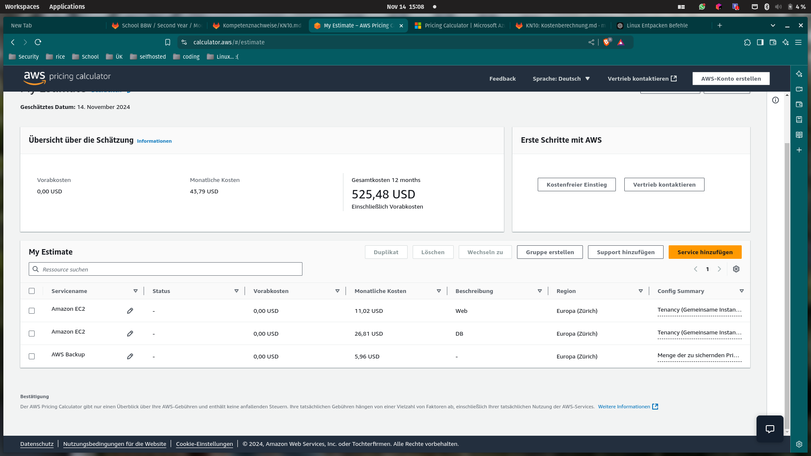

Web

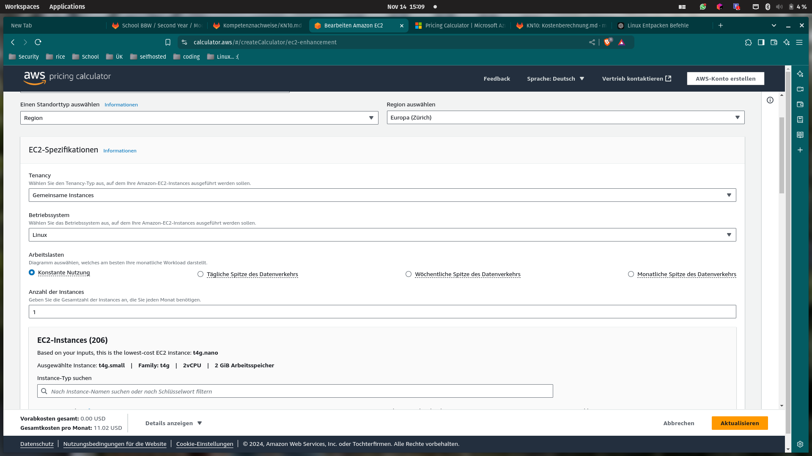
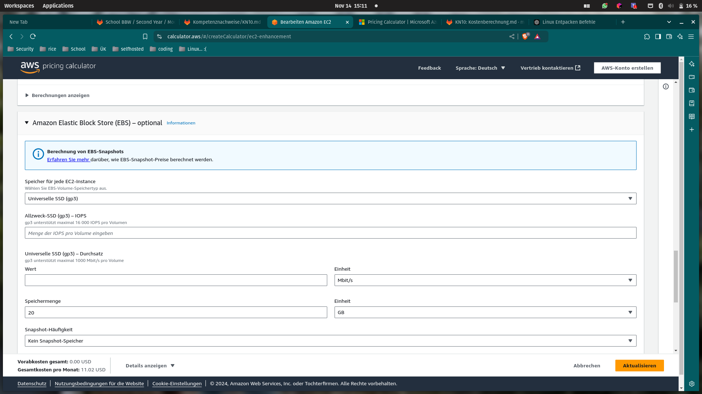

DB


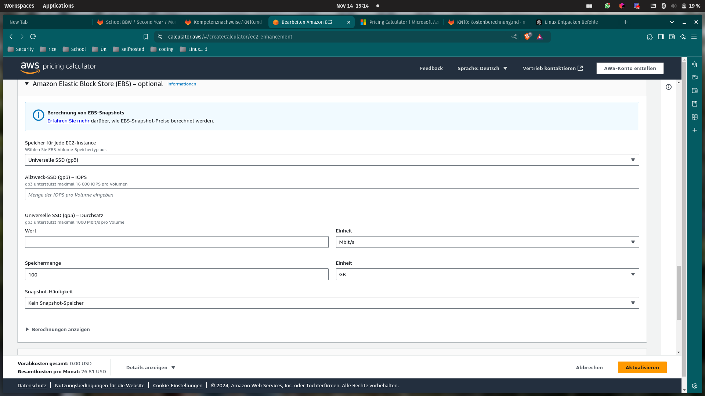

Backup

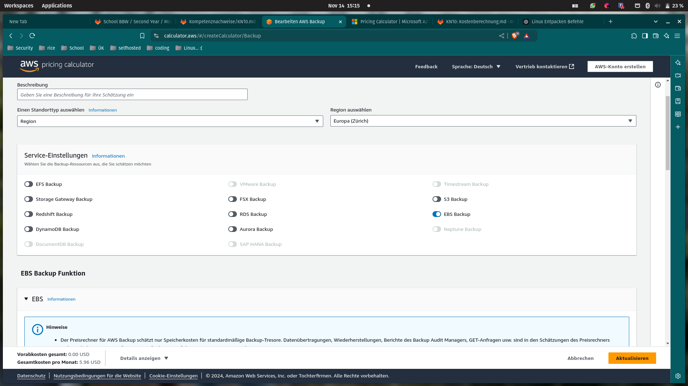
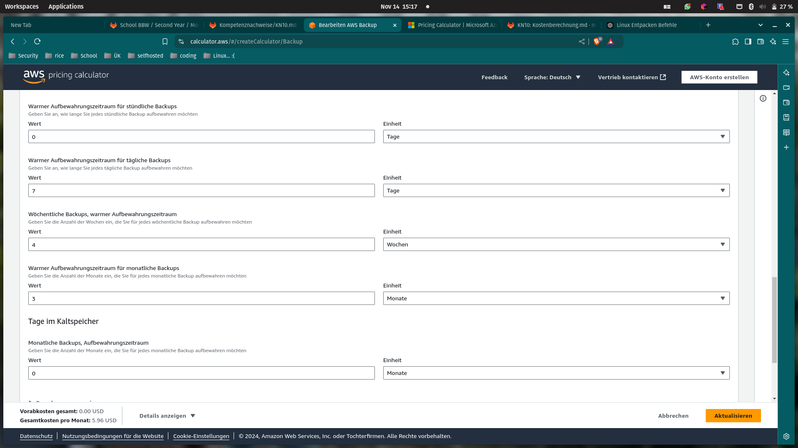
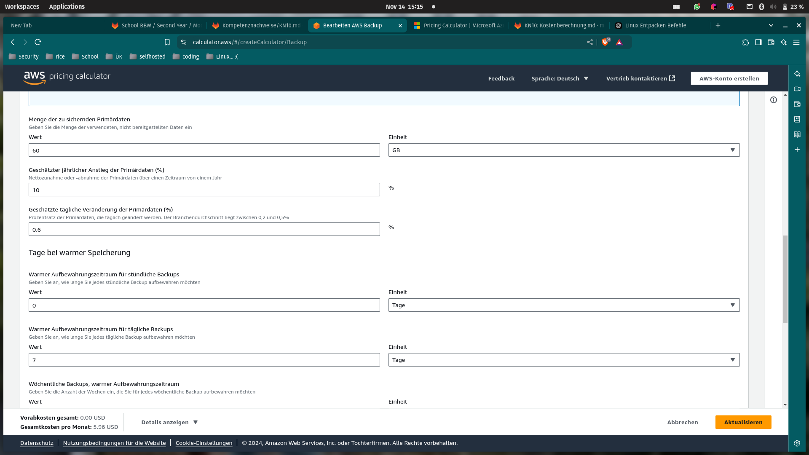

azure

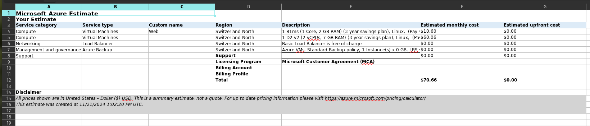


### Erklärung zu der Auswahl der Komponenten. Gehen Sie dabei auf die Abweichungen zu der On Premise Infrastruktur ein. Wichtig ist dabei wieso Sie eine Auswahl gemacht haben.

AWS

Ich habe die Ressourcen optimal skaliert und Monitoring eingerichtet, um Überdimensionierung zu vermeiden und bei Bedarf Anpassungen vorzunehmen. Zur Kostensenkung wurde ein 3 Jahres Plan gewählt, und die Daten werden DSGVO-konform (Das Schweizer gesetz) in der Schweiz gespeichert. Backups nutzen die exakt gleiche Backup methode mit auto-scaling Speichererweiterung, um Datensicherheit bei wachsendem Bedarf zu gewährleisten.

Azure

Die VMs wurden entsprechend dimensioniert, und der Load Balancer sorgt für Ausfallsicherheit. Zur Kostensenkung wurde ein 3 Jahres Plan (um kosten zu sparen) gewählt, und die Daten werden DSGVO-konform (nach Schweizer Gesetz) in der Schweiz gespeichert. Backups nutzen die gleiche Strategie wie bisher, jedoch mit automatischer Speichererweiterung, um maximale Datensicherheit zu gewährleisten.
## PAAS

### Screenshot der Kostenrechnung, so dass die Details der Komponenten sichtbar sind (CPU, RAM, Disk, etc)

pricing

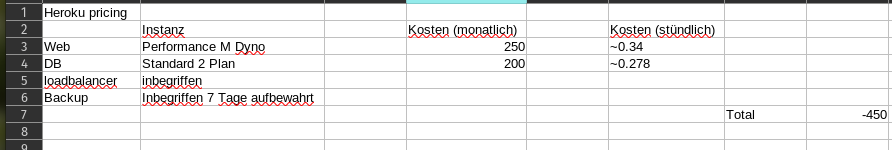

Komponente


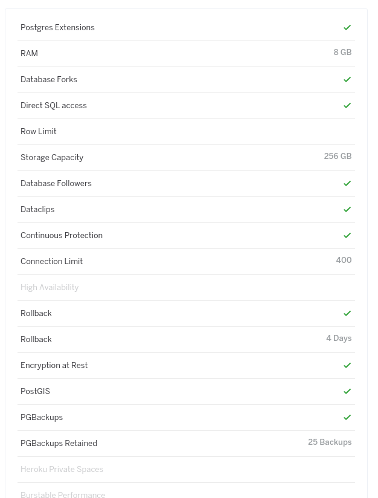

### Erklärung zu der Auswahl der Komponenten. Gehen Sie dabei auf die Abweichungen zu der On Premise Infrastruktur ein. Wichtig ist dabei wieso Sie eine Auswahl gemacht haben.

Ich habe die Instanz ausgewählt, da sie der On Premise Instanz am nächsten kommt und etwas mehr Leistung bietet als andere Optionen, die rund 1,5 GB weniger RAM hatten. Für die Datenbank habe ich mich für Heroku Postgres entschieden, da es eine verwaltete SQL Datenbank als Service bietet, die sich nahtlos in Heroku Anwendungen integrieren lässt, um Daten zu speichern und zu bearbeiten.

Wichtig zu erwähnen ist, dass sowohl ein Load Balancer als auch ein Backup bereits bereitgestellt werden, diese jedoch nicht vollständig der bisherigen On Premise Lösung entsprechen. Falls eine exakte Nachbildung der bestehenden Infrastruktur gewünscht wird, könnte zusätzlich ein Cloud Server als Backup Server eingerichtet werden.

## SAAS

### Screenshots des Pricings beider Anbieter und Angabe welches ausgewählt wird.

Zoho
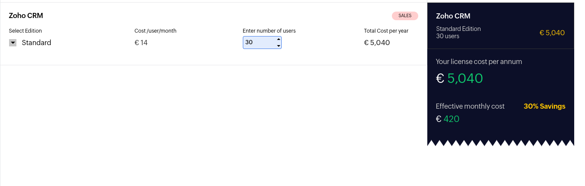

Salesforce
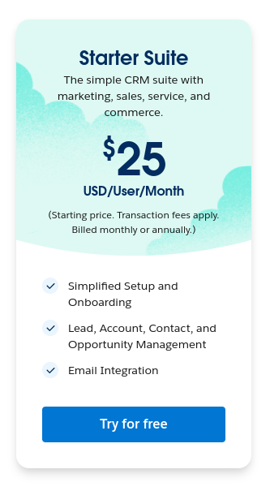

```
Total: 25 * 30 = 750 (Monatlich)
```

### Erklärung welches Pricing Sie pro Anbieter verwenden würden und wieso genau dieses.

Ich habe für beide SaaS-Lösungen das günstigste Preismodell gewählt, da es alle notwendigen Anforderungen erfüllt und zusätzliche Features nicht benötigt werden.

## Interpretation der Resultate

### Kosten. Beachten Sie auch mögliche Kosten, die nicht in den Kalkulatoren abgedeckt sind. Wieso sind die Kosten unterschiedlich? Sind die Unterschiede gerechtfertigt?

IaaS (Infrastructure as a Service): Man mietet virtuelle Hardware wie Server und Speicher. Zusätzliche Kosten können für Lizenzen, Sicherheitslösungen und Personal anfallen.

PaaS (Platform as a Service): Man nutzt eine Plattform zur Entwicklung und Bereitstellung von Anwendungen. Der Anbieter kümmert sich um die Infrastruktur. Kosten entstehen durch die Nutzung der Plattformdienste und eventuell für spezielle Entwicklungswerkzeuge.

SaaS (Software as a Service): Man greift auf fertige Anwendungen zu, die vom Anbieter bereitgestellt werden. Die Kosten basieren meist auf Abonnements pro Nutzer. Zusätzliche Gebühren können für erweiterte Funktionen oder Support anfallen.

Die Unterschiede in den Kosten sind gerechtfertigt, da der Anbieter je nach Modell unterschiedliche Aufgaben übernimmt und nicht ein zusätzlicher Mitarbeiter.

### Aufwand für Ihre Firma. Welche Arbeit müssten Sie als Firma in die verschiedenen Migrationsvarianten investieren

IaaS: Man ist verantwortlich für Installation, Wartung und Sicherheit der Systeme. Dies erfordert technisches Know-how und Zeit.

PaaS: Hier konzentriert man sich auf die Entwicklung der Anwendungen. Der Anbieter übernimmt die Verwaltung der Infrastruktur, was den Aufwand reduziert.

SaaS: Man nutzt die Anwendung direkt, ohne sich um technische Details kümmern zu müssen. Der Aufwand beschränkt sich auf die Einarbeitung und Anpassung der Geschäftsprozesse.

Die Wahl des passenden Modells sollte auf einer Abwägung zwischen Kosten, Kontrolle, Flexibilität und dem verfügbaren internen Know how (Qualifizierte Mitarbeiter)
basieren.