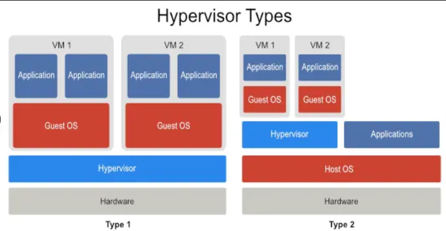

# Zusammenfassung für die Prüfung (Modul 346 - Cloud Lösungen konzipieren und realisieren)

## 1. Virtualisierung
- **Definition**: Verstehe, was Virtualisierung bedeutet und wie sie funktioniert.
- **Virtualisierung**: Virtualisierung bedeutet, dass man die Ressourcen eines Computers (z. B. Prozessor, Speicher, Festplatte) aufteilen kann, um mehrere unabhängige „virtuelle Computer“ darauf laufen zu lassen.

Jede virtuelle Maschine (VM) funktioniert wie ein echter Computer mit eigenem Betriebssystem und Programmen, aber sie teilen sich die Hardware des eigentlichen Computers.

- **Hypervisor was ist das**: Ein Hypervisor ist die Software oder Technologie, die Virtualisierung überhaupt möglich macht. Seine Hauptaufgabe ist es, die Hardware-Ressourcen (z. B. CPU, RAM, Speicher) eines Computers zu verwalten und sie an die virtuellen Maschinen (VMs) zu verteilen.

- **Hypervisor**:
  - **Typ 1**: Läuft direkt auf der Hardware ohne ein darunterliegendes Betriebssystem.
Er hat direkten Zugriff auf die Hardware und verwaltet die Ressourcen (z. B. CPU, RAM, Speicher) für die virtuellen Maschinen (VMs).(z.B. Microsoft Hyper-V (Core-Installation)
KVM (Kernel-based Virtual Machine)).
  - **Typ 2**: Ein Typ-2-Hypervisor läuft auf einem bestehenden Betriebssystem (Host-Betriebssystem).
Der Hypervisor ist im Grunde eine Software, die Ressourcen des Hosts nutzt, um virtuelle Maschinen auszuführen. (z.B. VirtualBox).

- **Hyperscaler**: Hyperscaler sind Grossanbieter von Cloud-Diensten, die eine hoch skalierbare und leistungsstarke Infrastruktur bereitstellen, um massive Mengen an Daten und Rechenlasten zu verarbeiten. Sie betreiben riesige Rechenzentren weltweit und bieten ihre Dienste über das Internet an. (z.B. AWS, Azure, Google Cloud).
- **Cloud-Schichten**: IaaS, PaaS, SaaS – ihre Aufgaben und Abstraktionsebenen.
---
## 2. Betriebsmodelle

### 1. **Rehosting (Lift-and-Shift)**
- Anwendungen und Daten werden ohne Änderungen in die Cloud migriert.
- Schnell und einfach, aber wenig optimiert für die Cloud.
- **Beispiel:** Migration einer virtuellen Maschine von einem lokalen Server zu AWS EC2.

### 2. **Replatforming**
- Anwendungen werden mit minimalen Anpassungen an die Cloud optimiert.
- Fokus auf Cloud-Funktionen wie Managed Databases oder Container-Dienste.
- **Beispiel:** Nutzung von AWS RDS anstelle eines eigenen Datenbankservers.

### 3. **Repurchasing (SaaS-Adoption)**
- Ersatz bestehender Anwendungen durch Cloud-native Softwarelösungen (SaaS).
- Erfordert oft Schulung, bietet aber hohe Skalierbarkeit und Wartungsfreiheit.
- **Beispiel:** Wechsel von einer lokalen CRM-Lösung zu Salesforce.

## **Cloud-Typen**
### 1. **Public Cloud**
- Ressourcen werden von einem Drittanbieter wie AWS, Azure oder Google Cloud bereitgestellt und geteilt.
- Kostengünstig, flexibel, aber weniger Kontrolle.
- **Geeignet für:** Dynamische Workloads und Startups.

### 2. **Private Cloud**
- Cloud-Infrastruktur wird exklusiv für ein Unternehmen bereitgestellt.
- Höhere Sicherheit und Kontrolle, aber teurer.
- **Geeignet für:** Unternehmen mit strikten Compliance-Anforderungen.

## **Beispiele für die Betriebsmodelle**
- **Rehosting:** Migration eines On-Premises-Webservers zu AWS EC2.  
- **Replatforming:** Verwendung von AWS Elastic Beanstalk für eine optimierte Webanwendung.  
- **Repurchasing:** Umstieg von lokal installierter Microsoft Office-Software auf Microsoft 365 (SaaS).

---
## 3. Servicemodelle
- **Modelle**:
 ### **IaaS (Infrastructure as a Service)**
- **Aufgabe:** Stellt grundlegende IT-Infrastruktur wie virtuelle Maschinen, Speicher, Netzwerke und Server zur Verfügung. Kunden verwalten die Infrastruktur und installieren ihre eigenen Betriebssysteme und Anwendungen.
- **Beispiele:** AWS EC2, Google Compute Engine, Microsoft Azure Virtual Machines.
- **Abstraktionsebene:** Kunden erhalten direkten Zugriff auf die virtuelle Hardware, die sie selbst konfigurieren und verwalten müssen.

---

### **PaaS (Platform as a Service)**
- **Aufgabe:** Bietet eine Plattform, auf der Entwickler ihre Anwendungen erstellen, ausführen und verwalten können, ohne sich um die zugrunde liegende Infrastruktur kümmern zu müssen (z. B. Betriebssysteme, Middleware).
- **Beispiele:** AWS Elastic Beanstalk, Google App Engine, Microsoft Azure App Services.
- **Abstraktionsebene:** Entwickler konzentrieren sich auf den Code und die Anwendung, während die Plattform die Verwaltung der Infrastruktur übernimmt.

---

### **SaaS (Software as a Service)**
- **Aufgabe:** Stellt vollständig entwickelte und verwaltete Softwarelösungen über das Internet bereit, die von Endnutzern direkt genutzt werden können, ohne dass Installation oder Wartung erforderlich ist.
- **Beispiele:** Google Workspace (Gmail, Google Docs), Microsoft 365, Salesforce.
- **Abstraktionsebene:** Nutzer verwenden die Software als fertiges Produkt; die zugrunde liegende Infrastruktur und Plattform sind vollständig abstrahiert.

---

### **FaaS (Function as a Service)**
- **Aufgabe:** Ermöglicht es Entwicklern, einzelne Funktionen oder Codeabschnitte als Dienste bereitzustellen, die automatisch ausgeführt werden, wenn sie benötigt werden. Kunden müssen sich nicht um die Verwaltung von Servern, die Skalierung oder den Betrieb der Infrastruktur kümmern.
- **Beispiele:** AWS Lambda, Google Cloud Functions, Microsoft Azure Functions.
- **Abstraktionsebene:** Entwickler schreiben nur den Code für bestimmte Funktionen, während die zugrunde liegende Infrastruktur, Skalierung und Ausführung vollständig von der Plattform verwaltet werden. Der Fokus liegt auf der Ereignis-gesteuerten Ausführung von Code.

---
## 4. (Cloud-) Migrationsmodelle
-# Zusammenfassung: Migrationsmodelle

## 1. Begriffe der Migrationsmodelle
- **Rehosting (Lift and Shift):** Direkte Migration ohne Änderungen am System.
- **Refactoring:** Anpassung von Teilen der Anwendung für die Zielplattform.
- **Rearchitecting:** Umstrukturierung der Architektur für bessere Skalierbarkeit und Performance.
- **Rebuilding:** Neubau der Anwendung von Grund auf.
- **Replacing:** Ersetzen durch eine neue, oft standardisierte Lösung (z. B. SaaS).

## 2. Zielplattform der Migrationsmodelle
- **Cloud-Infrastrukturen:** z. B. AWS, Azure, Google Cloud.
- **On-Premises:** Migration in eine eigene, lokale Infrastruktur.
- **Hybride Umgebungen:** Kombination aus Cloud- und On-Premises-Lösungen.
- **Auswahlkriterien:**
  - Kosten
  - Skalierbarkeit
  - Kompatibilität
  - Zukünftige Anforderungen

## 3. Argumentation für ein Migrationsmodell
- **Analyse des Szenarios:**
  - Technische Anforderungen
  - Budget
  - Zeitrahmen
  - Teamfähigkeiten
- **Abwägung der Modelle:**
  - **Beispiel:** Rehosting für schnelle Migration vs. Refactoring für langfristige Optimierung.
- **Empfehlung:** Auswahl eines Modells mit fundierter Begründung basierend auf den Anforderungen und Zielen des Projekts.
---

## 5. Speichermodelle

## 1. Die vier Speichermodelle
- **RAM (Arbeitsspeicher):** Flüchtiger Speicher mit sehr hoher Lese- und Schreibgeschwindigkeit.
- **Festplatte/HDD (Hard Disk Drive):** Persistenter Speicher, mechanisch und langsamer.
- **SSD (Solid State Drive):** Persistenter Speicher, schneller als HDD durch Flash-Speichertechnologie.
- **Netzwerkspeicher (z. B. NAS, Cloud-Speicher):** Persistenter Speicher, über Netzwerk erreichbar, Geschwindigkeit abhängig von der Netzwerkanbindung.

## 2. Einsatzbereiche der Speichermodelle
- **RAM:** 
  - Temporäre Daten während der Laufzeit von Programmen.
  - Anwendungen, die hohe Geschwindigkeit benötigen (z. B. Caching).
- **HDD:** 
  - Speicherung großer Datenmengen bei niedrigen Kosten.
  - Archivierung und Backups.
- **SSD:** 
  - Betriebssysteme, häufig genutzte Anwendungen und Daten.
  - Einsatz, wo schnelle Lese- und Schreibzugriffe erforderlich sind.
- **Netzwerkspeicher:**
  - Gemeinsame Nutzung von Daten in Teams oder Organisationen.
  - Cloud-Dienste für globale Verfügbarkeit.

## 3. Beispiele zur Nutzung der Speichermodelle
- **RAM:** Rendering von Videos, Echtzeitanalysen, temporäre Dateien bei Berechnungen.
- **HDD:** Speicherung von Filmen, Musik und Archiven.
- **SSD:** Installation von Betriebssystemen und Spielen, Hosting von Datenbanken.
- **Netzwerkspeicher:** Speicherung und Synchronisation von Dokumenten über Cloud-Dienste wie Google Drive, Dropbox.

## 4. Unterschied zwischen persistentem und flüchtigem Speicher
- **Flüchtiger Speicher:**
  - Speicherinhalte gehen verloren, wenn die Stromversorgung unterbrochen wird.
  - Beispiel: RAM in virtuellen Instanzen speichert temporäre Daten während der Laufzeit.
- **Persistenter Speicher:**
  - Daten bleiben erhalten, auch wenn die Stromversorgung unterbrochen wird.
  - Beispiel: Festplatten oder SSDs in virtuellen Maschinen speichern Daten dauerhaft.

## 5. Unterschied in Lese- und Schreibgeschwindigkeiten der Speichermodelle
- **RAM:** Sehr hohe Geschwindigkeit (nanosekunden Bereich), jedoch nicht persistent.
- **SSD:** Schnellere Zugriffe (micro- bis millisekunden Bereich) als HDD, besonders bei zufälligen Zugriffen.
- **HDD:** Langsamer durch mechanische Komponenten, besonders bei zufälligen Zugriffen.
- **Netzwerkspeicher:** Geschwindigkeit abhängig von der Netzwerkanbindung, typischerweise langsamer als lokale Speicherlösungen.
---

## 6. Netzwerk und Sicherheit
# Zusammenfassung: Netzwerkbegriffe, Ports und Sicherheit

## 1. Netzwerkbegriffe und Erklärungen
- **VPC (Virtual Private Cloud):** 
  - Ein isoliertes Netzwerk innerhalb einer Cloud, in dem Ressourcen wie Server und Datenbanken betrieben werden können.
- **Subnet:** 
  - Ein Unterabschnitt eines Netzwerks (z. B. VPC) mit einer eigenen IP-Adressspanne, um Ressourcen logisch zu organisieren.
- **Netzwerkinterface:** 
  - Die Schnittstelle, über die eine Ressource (z. B. virtuelle Maschine) mit dem Netzwerk kommuniziert.

## 2. Unterschied zwischen IP und IP-Range
- **IP-Adresse:**
  - Eindeutige Adresse einer Ressource in einem Netzwerk (z. B. 192.168.1.1).
- **IP-Range:**
  - Ein Bereich von IP-Adressen, der durch ein Präfix definiert wird (z. B. 192.168.1.0/24 umfasst alle Adressen von 192.168.1.0 bis 192.168.1.255).

## 3. Wichtige Ports und ihre Bedeutung
- **Was ist ein Port?**
  - Eine virtuelle Schnittstelle auf einer Netzwerkadresse, die Kommunikation für spezifische Dienste ermöglicht.
- **Wichtige Ports:**
  - **Port 22:** 
    - Protokoll: SSH (Secure Shell).
    - Verwendung: Sichere Remote-Verbindungen zu Servern.
  - **Port 80:** 
    - Protokoll: HTTP (Hypertext Transfer Protocol).
    - Verwendung: Übertragung von Webseiten im Internet.
  - **Port 3306:** 
    - Protokoll: MySQL.
    - Verwendung: Kommunikation mit MySQL-Datenbanken.

## 4. Sicherheitsthemen für Anbieter und Nutzer
- **Für Anbieter:**
  - **Firewall-Konfiguration:** Begrenzung des Zugriffs auf bestimmte Ports/IPs.
  - **DDoS-Schutz:** Schutz vor Überlastungsangriffen durch Netzwerksicherheitslösungen.
  - **Verschlüsselung:** Sicherstellen, dass Daten während der Übertragung geschützt sind.
  - **Monitoring:** Überwachung des Netzwerks auf verdächtige Aktivitäten.
- **Für Nutzer:**
  - **Passwort-Management:** Starke und sichere Passwörter verwenden.
  - **Software-Updates:** Regelmäßige Updates für Sicherheitslücken.
  - **VPN:** Nutzung eines Virtual Private Networks für sichere Verbindungen.
  - **Phishing-Schutz:** Bewusstsein für verdächtige E-Mails und Links.

## 5. Anwendung in Szenarien
- **Beispiel 1:** 
  - Eine VPC mit mehreren Subnetzen erstellen, um öffentlich zugängliche und private Ressourcen zu trennen.
- **Beispiel 2:** 
  - Einen Server auf Port 22 per SSH sichern und ungenutzte Ports in der Firewall schließen.
- **Beispiel 3:** 
  - MySQL-Datenbankzugriff über Port 3306 erlauben, aber nur für autorisierte IP-Ranges.
- **Beispiel 4:** 
  - Eine IP-Range definieren, um den Zugriff auf eine Cloud-Ressource auf eine bestimmte Gruppe von Geräten zu beschränken.
---

## 7. Cloud-init
# Zusammenfassung: YAML, Cloud-init und Infrastructure As Code (IaC)

## 1. Grundelemente von YAML
- **Syntax und Struktur:**
  - **Key-Value-Paare:** `key: value`
  - **Listen:** 
    ```yaml
    items:
      - item1
      - item2
    ```
  - **Verschachtelung:** Durch Einrückungen.
    ```yaml
    parent:
      child: value
    ```
  - **Kommentare:** Mit `#` eingeleitet.
- **Erkennung in Cloud-init Dateien:**
  - Cloud-init verwendet YAML, um Anweisungen für die Initialisierung virtueller Maschinen zu definieren.

## 2. Vorteile von Cloud-init
- **Automatisierung:** 
  - Automatische Konfiguration und Einrichtung virtueller Instanzen.
- **Flexibilität:** 
  - Unterstützung für verschiedene Betriebssysteme und Plattformen.
- **Effizienz:** 
  - Spart Zeit durch die Bereitstellung vorinstallierter Pakete, Benutzerkonten und Netzwerkkonfigurationen.

## 3. Wichtige Elemente von Cloud-init
- **Beispiele:**
  - **Benutzer hinzufügen:**
    ```yaml
    users:
      - name: user1
        groups: sudo
        ssh-authorized-keys:
          - ssh-rsa ...
    ```
  - **Pakete installieren:**
    ```yaml
    packages:
      - nginx
      - git
    ```
  - **Befehle ausführen:**
    ```yaml
    runcmd:
      - echo "Hello, World!" > /var/www/html/index.html
    ```
  - **Dateien erstellen:**
    ```yaml
    write_files:
      - path: /etc/myconfig.conf
        content: |
          setting1: value1
          setting2: value2
    ```

## 4. Nutzung der offiziellen Referenz
- Die [offizielle Cloud-init-Dokumentation](https://cloud-init.io/) bietet:
  - Eine vollständige Liste aller Konfigurationsmodule.
  - Beispiele für die Anwendung und Syntax jedes Elements.
  - Schritt-für-Schritt-Anleitungen zur Implementierung neuer Features.

## 5. Installation einer virtuellen Instanz mit Cloud-init
- Schritte:
  1. Erstellung einer Cloud-init Datei (z. B. `user-data.yaml`) mit YAML-Inhalt.
  2. Verknüpfung der Datei mit einer virtuellen Maschine während der Erstellung.
  3. Die Instanz führt Cloud-init automatisch beim Start aus, basierend auf den angegebenen Konfigurationen.

## 6. Begriff: "Infrastructure As Code" (IaC)
- **Definition:**
  - Die Verwaltung und Bereitstellung von IT-Infrastruktur erfolgt durch spezielle Dateien, die genau beschreiben, wie die Systeme aussehen und funktionieren sollen – ohne manuelle Eingriffe. (z.b Terraform)
- **Vorteile:**
  - **Reproduzierbarkeit:** Konsistente Ergebnisse bei wiederholter Bereitstellung.
  - **Skalierbarkeit:** Automatisierte Anpassung an grössere Workloads.
  - **Versionskontrolle:** Änderungen können wie Code in Git verwaltet werden.

## 7. Produkte für "Infrastructure As Code"
- **Bekannte Produkte:**
  - **Terraform:** Plattformunabhängige IaC-Lösung zur Bereitstellung und Verwaltung von Cloud-Ressourcen.
  - **Ansible:** Automatisierungs- und Konfigurationstool, das YAML für Playbooks verwendet.
  - **CloudFormation:** AWS-spezifisches IaC-Tool zur Verwaltung von AWS-Ressourcen.
  - **Pulumi:** Modernes IaC-Tool, das Programmiersprachen wie Python, JavaScript oder Go unterstützt.
  - **Chef und Puppet:** Tools zur Konfigurationsverwaltung und Automatisierung.


---